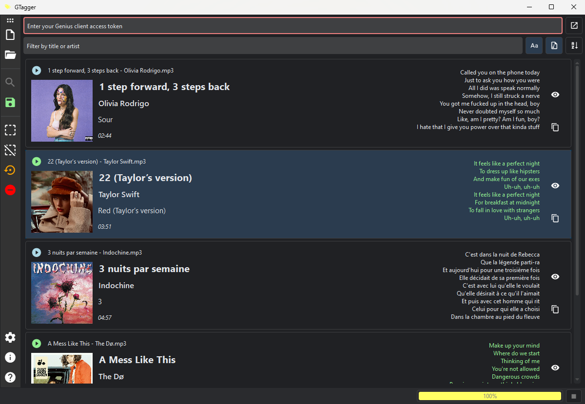

# GTagger

GTagger is a python tool that adds lyrics from [Genius](https://genius.com/) to `.mp3` files.



It uses [wrap-genius](https://github.com/fedecalendino/wrap-genius) to find the track's Genius ID based on its title and artist, and [LyricsGenius](https://github.com/johnwmillr/LyricsGenius) to fetch the lyrics automatically.

## WIP

GTagger is a work in progress, so it lacks functionnalities and it may be buggy. To avoid any issue with your files, please backup them first.

## Usage

### On Windows

Download the executable `gtagger.exe` from the [Releases](https://github.com/maelchiotti/GTagger/releases) and execute it.

### From source

- Install the required dependencies:

    ```shell
    pip install -r requirements.txt
    ```

- Launch GTagger with the following command:

    ```shell
    py main.py
    ```

## TODO

- Improve the status bar
  - Add a progression bar
  - Add a button to toggle light/dark theme

- Improve the display of the songs list

- Toggle the save lyrics button automatically

- Improve the settings window to be a `QtCore.Qt.Tool` so that it keeps focus

- Add options:
  - Ignore files with lyrics
